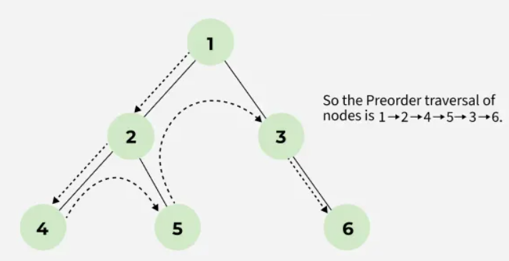
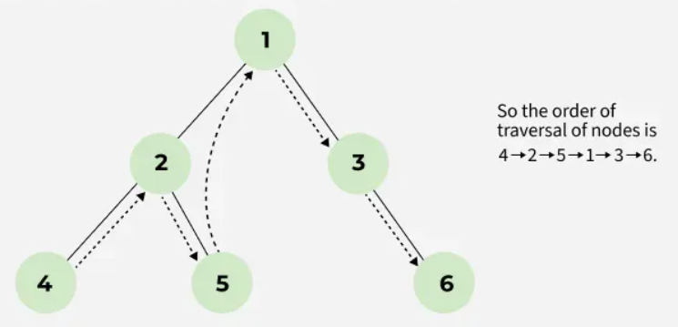
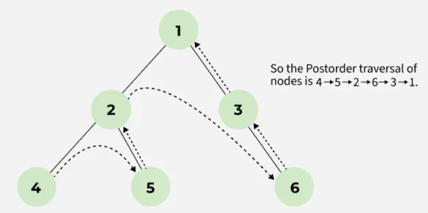

# Datastructures and Algorithms

Currently commiting to Leetcoding, I'm saving here the list of Algorithms I'm most using for problem solving.
Purpose is having a daily shortcut/summary for Drill/Kata training.

### Cheatsheet

I also trained using C#, so I made myself a short syntax recap here : [Syntax recap](c#_syntax_recap.cs)

## Problems Lists

Blind-75: [https://neetcode.io/practice](https://neetcode.io/practice)\
Grind-75: [https://www.techinterviewhandbook.org/grind75](https://www.techinterviewhandbook.org/grind75)\
Sean Prashad-180 : [https://seanprashad.com/leetcode-patterns/](https://seanprashad.com/leetcode-patterns/)\
Leetcode-75: [https://leetcode.com/studyplan/leetcode-75/](https://leetcode.com/studyplan/leetcode-75/)\
Team Blind List : [https://www.teamblind.com/post/New-Year-Gift---Curated-List-of-Top-100-LeetCode-Questions-to-Save-Your-Time-OaM1orEU](https://www.teamblind.com/post/New-Year-Gift---Curated-List-of-Top-100-LeetCode-Questions-to-Save-Your-Time-OaM1orEU)

## Cheatsheet

Below is a Cheatsheet of the Input format > Problem goal > Algorithm to use :\
See also Flowchart from AlgoMonster : [https://algo.monster/flowchart](https://algo.monster/flowchart)

-   Array

    -   Sorted

        -   [Binary Search](binary_search.py)
        -   [Two Pointers](two_pointers_reverse.py)

    -   Unsorted

        -   HashMap
        -   HashSet

    -   String to Build

        -   Stack

    -   SubArrays

        -   [Sliding Window](sliding_window.py)

    -   Max/Min, Top/Least K items

        -   [Heap](heap.py)

    -   Common Strings
        -   Trie : 208 leetcode

-   Graph

    -   Shortest path

        -   [BFS](graph_BFS.py)

    -   Else
        -   [DFS](graph_DFS.py)

-   Tree

    -   Question about Depth/Levels
        -   [BFS](BFS.py)
    -   Else
        -   DFS : [Preorder](DFS_preorder.py), [Inorder](DFS_inorder.py), [Postorder](DFS_postorder.py)

-   Linked List

    -   Cycle or Split list

        -   [Fast and Slow Pointers](slow_fast_pointer.py)

    -   Reverse

        -   Prev pointer

    -   Return original Head
        -   Dummy Pointer

-   Sort

    -   [Merge Sort](merge_sort.py)

    -   [Quick Sort](quick_sort.py)

## Tree traversal details

#### **Pre-order**

Root -> Left -> Right

-   If you know you need to explore the roots before inspecting any leaves, you pick pre-order because you will encounter all the roots before all of the leaves.

-   Used to create a copy of a tree. For example, if you want to create a replica of a tree, put the nodes in an array with a pre-order traversal. Then perform an Insert operation on a new tree for each value in the array. You will end up with a copy of your original tree.

#### **In-order**

Left -> Root -> Right

-   In the case of binary search trees (BST), In-order traversal gives nodes in non-decreasing order.

#### **Post-order**

Left -> Right -> Root

-   Used to delete a tree from leaf to root.
-   If you know you need to explore all the leaves before any nodes, you select post-order because you don't waste any time inspecting roots in search for leaves.
-   It can help in garbage collection algorithms, particularly in systems where manual memory management is used.

## Training routine

-   Array/String

    -   [Binary Search](https://leetcode.com/problems/binary-search/description/)
    -   [Two-Pointers : 2 arrays traversal](https://leetcode.com/problems/merge-strings-alternately/description/)
    -   [Two-Pointers : Opposite direction](https://leetcode.com/problems/two-sum-ii-input-array-is-sorted/description/)
    -   [Sliding Window : Fixed size](https://leetcode.com/problems/contains-duplicate-ii/description/)
    -   [Sliding Window : Variable size](https://leetcode.com/problems/longest-substring-without-repeating-characters/description/)
    -   [Merge Intervals](https://leetcode.com/problems/merge-intervals/description/) - [(Doc)](https://medium.com/codex/grokking-the-coding-interview-pattern-merge-interval-6e6b1e9e038c)
    -   [Merge Sort](https://leetcode.com/problems/sort-an-array/description/)
    -   [Quick Sort](https://leetcode.com/problems/sort-an-array/description/)

-   Tree

    -   [Tree DFS : Preorder](https://leetcode.com/problems/binary-tree-preorder-traversal/description/)
    -   [Tree DFS : Inorder](https://leetcode.com/problems/binary-tree-inorder-traversal/description/)
    -   [Tree DFS : Postorder](https://leetcode.com/problems/binary-tree-postorder-traversal/description/)
    -   [Tree BFS](https://leetcode.com/problems/binary-tree-level-order-traversal/description/)

-   Graph

    -   Matrix
        -   [Number of Islands](https://leetcode.com/problems/number-of-islands/description/)
        -   [Max Area of Island](https://leetcode.com/problems/max-area-of-island/description/)
        -   [Pacific Atlantic Water Flow](https://leetcode.com/problems/pacific-atlantic-water-flow/)
    -   Adjacency List
        -   (To Do)

-   Linked List

    -   [Fast and Slow Pointers: Find middle](https://leetcode.com/problems/middle-of-the-linked-list/description/)
    -   [Fast and Slow Pointers: Find cycle](https://leetcode.com/problems/linked-list-cycle/description)
    -   [Reverse a Linked List](https://leetcode.com/problems/reverse-linked-list/description/)
    -   [Merge Two Sorted Lists](https://leetcode.com/problems/merge-two-sorted-lists/description/)
    -   [Reorder List](https://leetcode.com/problems/reorder-list/description/)
    -   [Remove Nth Node From End of List](https://leetcode.com/problems/remove-nth-node-from-end-of-list/description/)

-   Heap

    -   [Top K Frequent Elements](https://leetcode.com/problems/top-k-frequent-elements/description/)

-   Backtracking

    -   [Find all solutions](https://leetcode.com/problems/generate-parentheses/description/)
    -   [Word Search](https://leetcode.com/problems/word-search/description/)
    -   [Combinations](https://leetcode.com/problems/combinations/description/)
    -   [Permutations](https://leetcode.com/problems/permutations/description/)
    -   [Permutations II](https://leetcode.com/problems/permutations-ii/description/)
    -   [Subsets](https://leetcode.com/problems/subsets/description/)
    -   [Subsets II](https://leetcode.com/problems/subsets-ii/description/)
    -   [Combination Sum](https://leetcode.com/problems/combination-sum/description/)
    -   [Combination Sum II](https://leetcode.com/problems/combination-sum-ii/description/)

-   Monotonic Stack
    -   [Daily Temperatures](https://leetcode.com/problems/daily-temperatures/description/)
    -   [Next Greater Element I](https://leetcode.com/problems/next-greater-element-i/description/)
    -   [Final Prices With a Special Discount in a Shop](https://leetcode.com/problems/final-prices-with-a-special-discount-in-a-shop/description/)

Todo :

-   Add Merge Intervals
-   Add Graph with : adjacency lists and edge lists
-   Add Trie
-   Add Memoization/Dynamic prog.
